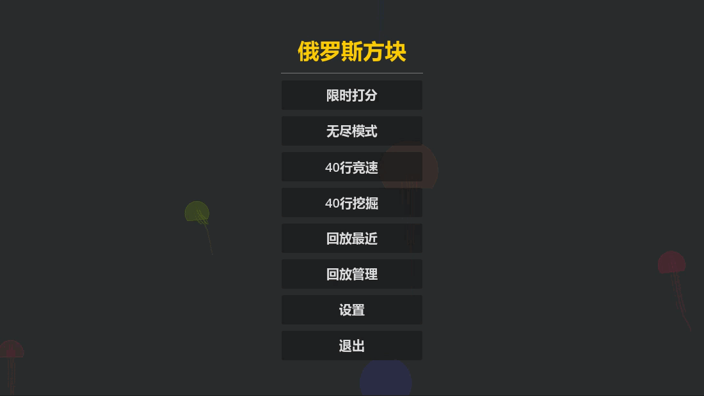
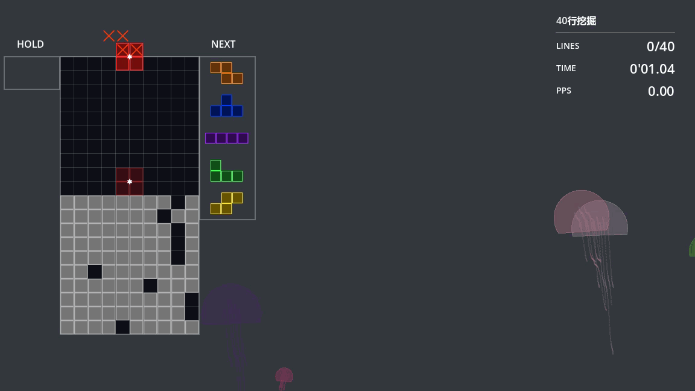
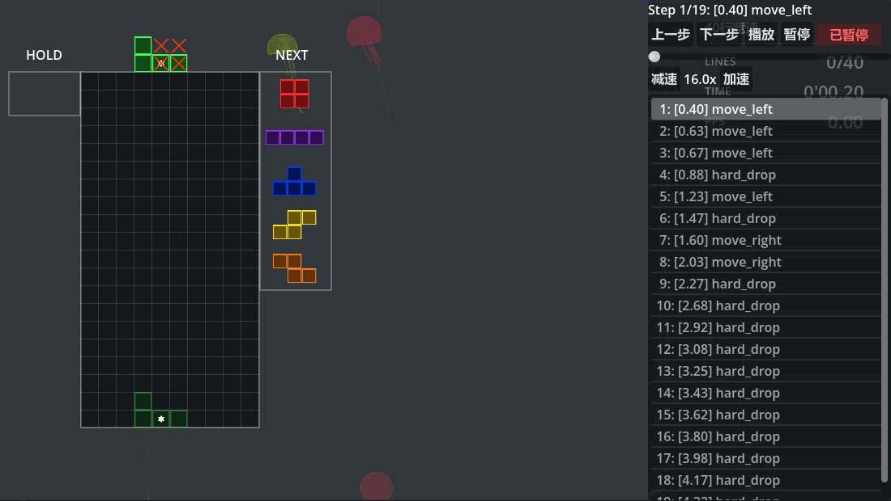

# 🎮 Tetris - 俄罗斯方块 (Godot 4.x)

[](https://godotengine.org/)
[](LICENSE)

> 基于 Godot 4.x 开发的现代俄罗斯方块游戏，完整复刻官方规则，支持 4 种玩法模式、SRS 旋转系统、7-Bag 随机生成器和回放功能。

[项目详细分析链接-DeepWiki](https://deepwiki.com/msccreater/Tetris)





---

## 📋 目录

- [功能特性](#-功能特性)
- [快速开始](#-快速开始)
- [游戏模式](#-游戏模式)
- [操作指南](#-操作指南)
- [技术实现](#-技术实现)
- [项目结构](#-项目结构)
- [贡献指南](#-贡献指南)
- [许可证](#-许可证)

---

## ✨ 功能特性

### 🎯 核心玩法
- ✅ **4 种游戏模式**：限时打分、无限模式、40行竞速、40行挖掘
- ✅ **SRS 旋转系统**：Super Rotation System, 并显示旋转中心点
- ✅ **7-Bag 随机生成器**：保证每 7 块内所有方块各出现一次，公平随机
- ✅ **自定义DAS和ARR**：自定义DAS和ARR延迟
- ✅ **皮肤支持**：支持更换积木皮肤
- ✅ **幽灵块 (Ghost Piece)**：预览方块落点
- ✅ **Hold 功能**：暂存当前方块
- ✅ **回放系统**：自动记录并回放对局

### 🎮 游戏模式详解

| 模式 | 目标 | 说明 |
|:---|:---|:---|
| **限时打分** | 2分钟内获得最高分 | 经典马拉松模式，速度随消行增加 |
| **无限模式** | 尽可能存活并得分 | 无时间限制，挑战最高纪录 |
| **40行竞速** | 以最快速度消除40行 | 标准 Sprint 模式，衡量玩家速度水平 |
| **40行挖掘** | 消除40行垃圾行 | 练习挖掘技巧，垃圾行为九砖一洞 |

### 🛠️ 技术特性
- ✅ **DAS/ARR 可调**：自定义延迟自动移动和自动重复速率
- ✅ **硬降/软降**：支持快速下落和缓降
- ✅ **T-Spin 检测**：支持检测T-Spin
- ✅ **连击系统**：连续消行奖励
- ✅ **Back-to-Back**：连续特殊消除奖励

---

## 🚀 快速开始

### 环境要求
- [Godot 4.2+](https://godotengine.org/download)
- Windows / macOS / Linux

### 安装运行

```bash
# 1. 克隆仓库
git clone https://github.com/msccreater/Tetris.git
cd Tetris

# 2. 用 Godot 打开项目
# 启动 Godot -> 导入 -> 选择 project.godot

# 3. 运行场景
# F5 或点击播放按钮
```

## 🎮 操作指南

### 键盘控制(游戏)

| 按键 | 动作 |
|:---:|:---|
| `← →` / `A,D` | 左右移动 |
| `↑` / `X` | 顺时针旋转 |
| `Z` | 逆时针旋转 |
| `R` | 180°旋转 |
| `↓` | 软降（加速下落） |
| `空格` | 硬降（瞬间落底） |
| `Shift` / `C` | Hold（暂存方块） |
| `Esc` | 暂停菜单 |

### 键盘控制(回放)

| 按键 | 动作 |
|:---:|:---|
| `Tab` | 显示/隐藏控制面板 |
| `←` | 上一个动作 |
| `→` | 下一个动作 |
| `P` / `空格` | 暂停/继续 |
| `↑` / `+` | 加速播放 |
| `↓` / `-` | 减速播放 |

---

## 🙏 致谢

- [Godot Engine](https://godotengine.org/) - 优秀的开源游戏引擎
- 所有贡献者和玩家！

---

> 🌟 如果这个项目对你有帮助，请给个 Star！
